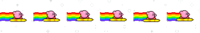

# FLying Kirby
## Giới thiệu chung
- Họ và tên: Nguyễn Thị Thu Hà
- MSSV: 22024571
- Lớp học phần: 2324H_INT2215_70
- Tên sản phẩm: Flying Kirby
  
## Lời nói đầu
Flying Kirby là một tựa game được phát triển dựa trên bản gốc là Dinosaur Game với các chức năng cơ bản, thêm một vài chức năng hoàn thiện và đổi mới về hình ảnh theo ý tưởng cá nhân của em với nhân vật chính là Kirby. Đây là một nhân vật nhỏ xinh dễ thương nhưng lại rất dũng cảm trên hành trình đối đầu với kẻ địch bảo vệ ngôi nhà của mình.    
Một số tài nguyên em đã từng làm từ dự án cũ vẫn được tận dụng lại để đáp ứng tiến độ thời gian của sản phẩm.

## Cách chơi game 
**1. Khởi động trò chơi**
Mở đầu, người chơi sẽ thấy màn hình Menu game. Tại đây có 3 lựa chọn cho người chơi lần lượt là **Play**(chơi), **Help**(hướng dẫn), **Exit**(thoát trò chơi). 
**2. Chơi và xử lý thử thách**
Khi người chơi tham gia trò chơi, người chơi phải cố gắng vượt qua nhiều vật cản như cây, chim bằng cách nhấn nút **SPACE** hoặc **UP**. Tốc độ của màn chơi sẽ tăng dần lên theo thời gian và số điểm, người chơi có thể nhấn **PAUSE** để tạm dừng trò chơi - nhấn **CONTINUE** để tiếp tục trò chơi.
**3. Kết thúc trò chơi**
Khi người chơi chạm phải các chướng ngại vật thì trò chơi sẽ kết thúc. Người chơi nhận điểm và có thể xác lập mục Điểm cao. Nhấn **SPACE** để tiếp tục chơi lại vòng chơi mới. 

# Các thông tin chi tiết 
**1. Menu trò chơi**
   
   
**2. Hướng dẫn (Help)**
   Giới thiệu ngắn gọn về trò chơi để người chơi nắm thông tin cơ bản:
   
   
**3. Hình ảnh khi chơi trò chơi**

**4. Hình ảnh khi thất bại**

**7. Nhân vật chính**
- Kirby: 
  
**8. Các kẻ địch**
- Kẻ địch trên không: 
- Kẻ địch mặt đất: 

# Các nguồn tham khảo 
- Code, quản lý, tổ chức 1 dự án game tại:
  [Phát triển phần mềm 123A-Z](https://www.youtube.com/c/Ph%C3%A1tTri%E1%BB%83nPh%E1%BA%A7nM%E1%BB%81m123AZ)
  [Series game Jack Adventure của CLB Lập trình PTIT](https://www.youtube.com/c/CLBL%E1%BA%ADpTr%C3%ACnhPTIT)
  [Let's Make Games]
- Hình ảnh: Pinterest, nhân vật enemy lấy từ nguồn tham khảo trên
- LazyFoo SDL Tutorial
  
# Tổng kết 
### Những kiến thức đã học được
- Về kỹ năng: hiểu cách cơ cấu thành phần tổ chức 1 game và 1 dự án hoàn chỉnh; biết cách tổ chức và tự học, tự tìm tòi nhiều hơn; sáng tạo hơn và nâng cao kĩ năng giải quyết vấn đề.
- Về kiến thức: nâng cao kỹ thuật lập trình, xây dựng từng lớp dự án bài bản hơn, hiểu về hoạt động của thư viện SDL2, ôn lại về git và github

### Những điều mong muốn cải thiện 
- Có thể làm được nhiều tính năng nâng cao hơn cho game.
- Phát triển Map cho game, tính năng chiến đấu cho nhân vật.
- Tổ chức dự án chuyên nghiệp hơn.
# Video game
- Video giới thiệu về game: [video game](https://drive.google.com/drive/folders/1sJAXfsVsCrmdvV2j2T2fz2-Mn_z1dYZ6)
