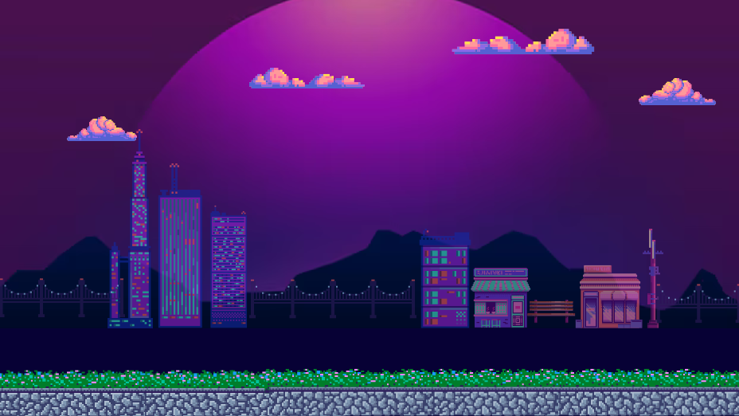

# Giới thiệu chung
- Họ và tên: Nguyễn Thị Thu Hà
- MSSV: 22024571
- Lớp học phần: 2324H_INT2215_70
- Tên sản phẩm: Flying Kirby
  
# Lời nói đầu
Flying Kirby là một tựa game được phát triển dựa trên bản gốc là Dinosaur Game với các chức năng cơ bản, thêm một vài tính năng thú vị và đổi mới về hình ảnh theo ý tưởng cá nhân của em với nhân vật chính là Kirby. Đây là một nhân vật nhỏ xinh dễ thương nhưng lại rất dũng cảm trên hành trình đối đầu với kẻ địch bảo vệ ngôi nhà của mình.    
Một số tài nguyên em đã từng làm từ dự án cũ vẫn được tận dụng lại để đáp ứng tiến độ thời gian của sản phẩm.
Video giới thiệu về game:

# Cách chơi game 
Mở đầu game người chơi có thể lựa chọn chơi game hoặc đọc hướng dẫn về các phím điều khiển
Khi người chơi tham gia trò chơi, người chơi phải cố gắng vượt qua nhiều vật cản như đá, cây,..và khi đối đầu với vật cản như chim, người chơi có thể sử dụng bắn chiêu để tiêu diệt. Tốc độ của màn chơi sẽ tăng dần lên theo thời gian và số điểm, người chơi cũng có thể ăn phần thưởng dọc đường (1 tim) để lấy thêm 1 mạng và có thể có tối đa 3 mạng. 
Khi người chơi chơi hết mạng, game sẽ kết thúc và điểm xuất hiện. Người chơi có thể xem bảng điểm cao (dự kiến làm thôi ạ =)).

# Các thông tin chi tiết 
1. Menu trò chơi
   
3. Hướng dẫn (Help)
   Giới thiệu ngắn gọn về trò chơi để người chơi nắm thông tin cơ bản
4. 
5. 
6. Nhân vật chính
   
7. Các vật cản, kẻ địch
8. Cách thức điều khiển - chiêu bắn
9. Số lượt mạng
10. Bảng điểm cao

# Các nguồn tham khảo 
- Hình ảnh đồ họa được xử lý từ 1 gif và các nguồn sẵn khác.
  
# Tổng kết 
- Những kiến thức đã học được
- Những điều mong muốn cải thiện 
